# ReServe AI — Rescue More. Waste Less.

> **Campus Food Surplus Prevention & Intelligent Redistribution Platform**  
> *Developed for the **1M1B – IBM SkillsBuild & AICTE AI for Sustainability Virtual Internship (July–September 2026)**.*  
> *Aligned with United Nations Sustainable Development Goals **SDG 12** (Responsible Consumption & Production), **SDG 2** (Zero Hunger), and **SDG 11** (Sustainable Cities & Communities).*

[](https://reserve-ai.vercel.app)
[](https://neon.tech)
[](https://nextjs.org)
[](docs/ReServe-AI-Rescue-More-Waste-Less.pptx)
[](LICENSE)

---

## 👨‍🎓 Student & Institutional Information

* **Student Name**: Ilakkiyan J
* **College / Institution Name**: Karpagam College of Engineering
* **Branch / Field of Study**: Computer Science & Design
* **Mentor Name**: Manasa
* **Program**: 1M1B – IBM SkillsBuild AI + Sustainability Virtual Internship
* **Batch**: July – September 2026 Batch

---

## 🚀 Live Demo & Deployment

* **Live Demo URL**: [https://reserve-ai.vercel.app](https://reserve-ai.vercel.app) *(Deploy to Vercel to activate link)*
* **Cloud Database**: Neon Postgres (`neondb`)
* **GitHub Repository**: [https://github.com/ilakkiyan-j/ReServe-AI.git](https://github.com/ilakkiyan-j/ReServe-AI.git)

## 📸 Master Presentation Slide Deck (16 Slides)

> 📁 **Presentation File**: [`docs/ReServe-AI-Rescue-More-Waste-Less.pptx`](docs/ReServe-AI-Rescue-More-Waste-Less.pptx)  

<details open>
<summary><b>▶️ Click here to expand / collapse the 16-Slide Presentation Deck</b></summary>

<br>

### 🎴 Slide 1: Title & Project Overview
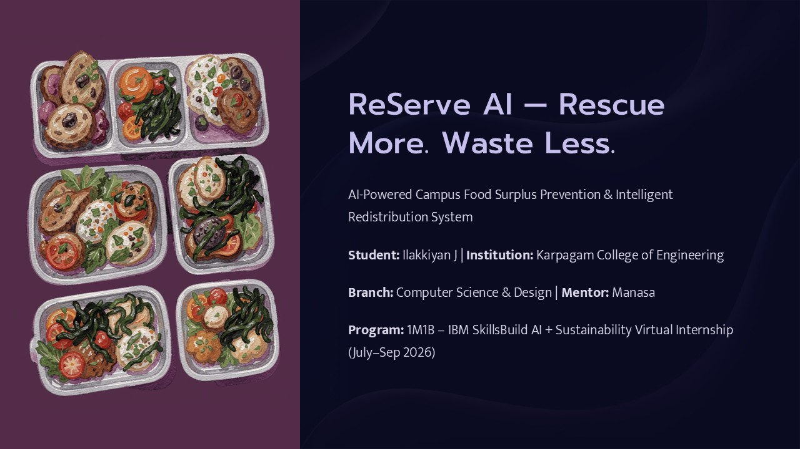

---

### 🎴 Slide 2: The Problem — Campus Food Waste at Scale
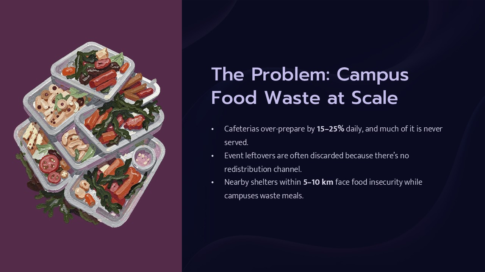

---

### 🎴 Slide 3: Central Question & Design Thinking Framework
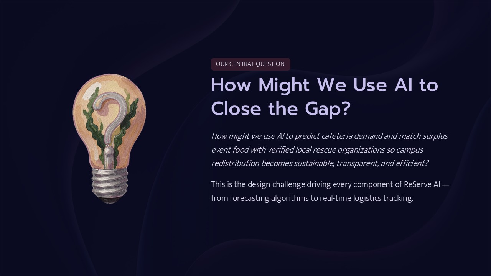

---

### 🎴 Slide 4: UN Sustainable Development Goals Alignment
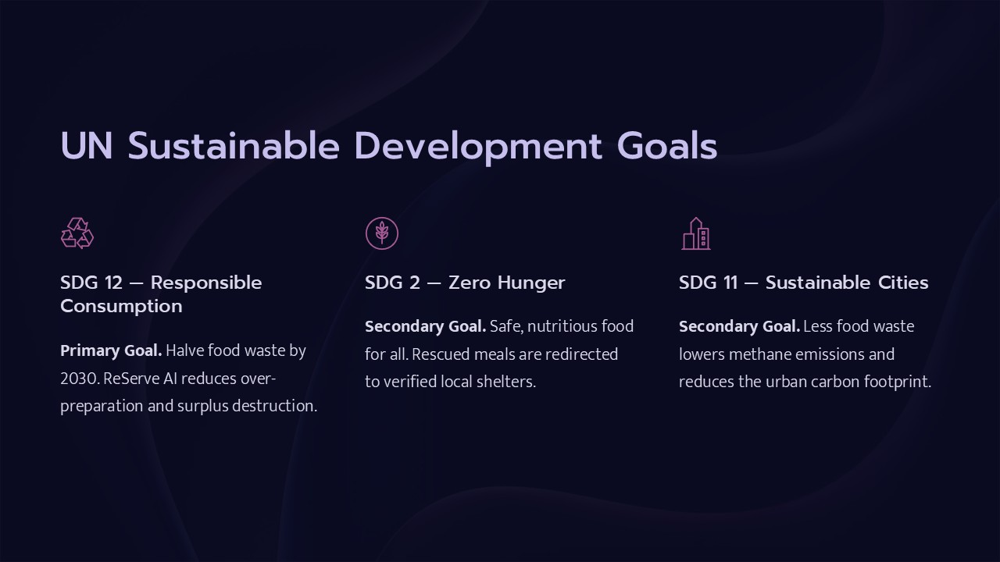

---

### 🎴 Slide 5: The Solution — Dual-Mode AI Platform
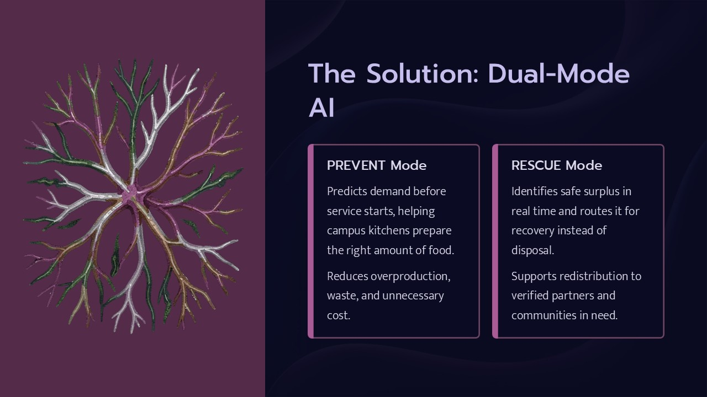

---

### 🎴 Slide 6: PREVENT Mode — Demand Forecasting Engine
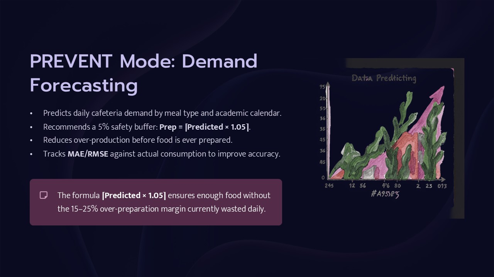

---

### 🎴 Slide 7: RESCUE Mode — Intelligent NLP & NGO Matching Engine
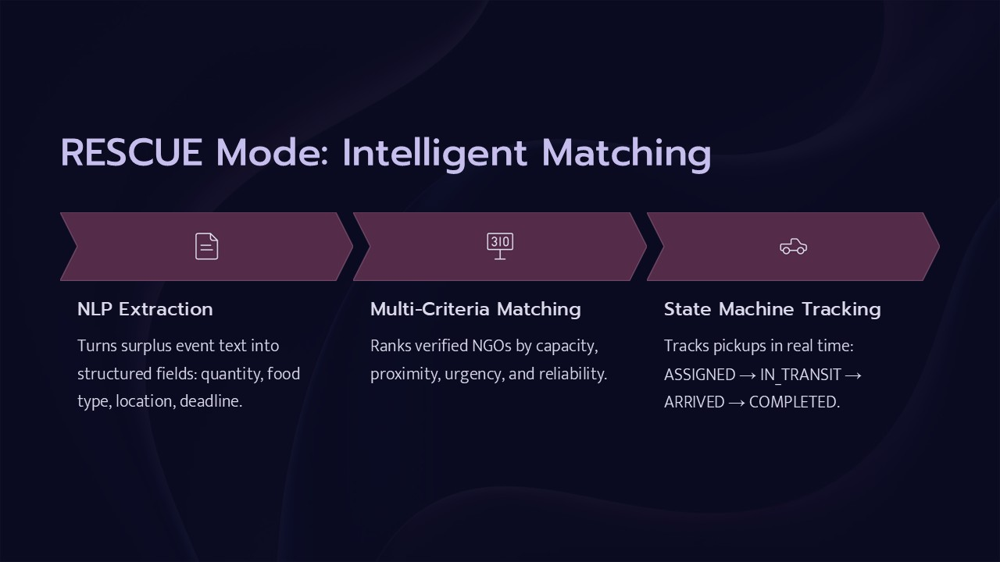

---

### 🎴 Slide 8: Decoupled AI Agent Architecture
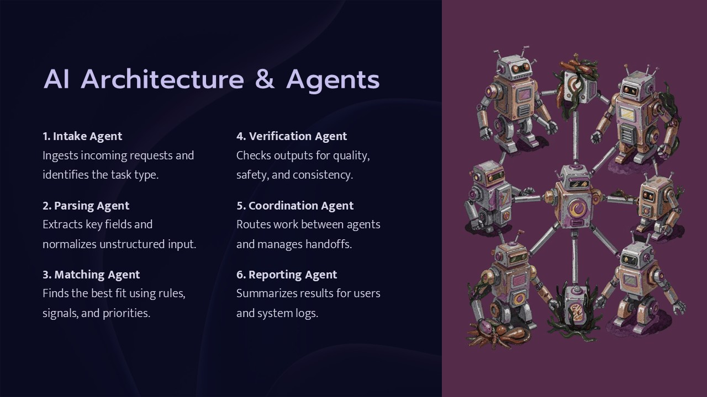

---

### 🎴 Slide 9: Mathematical Formulas & Matching Matrix
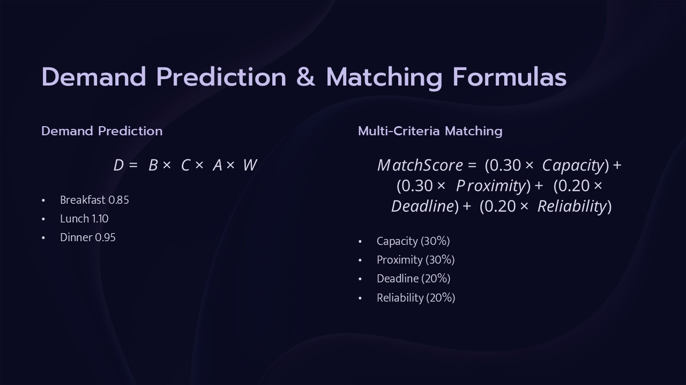

---

### 🎴 Slide 10: Technical Implementation & Stack
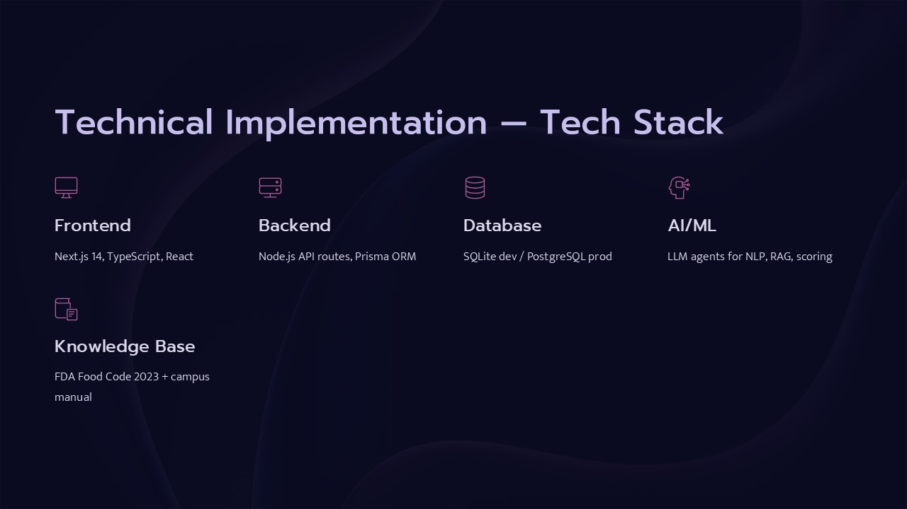

---

### 🎴 Slide 11: End-to-End System Data Flow
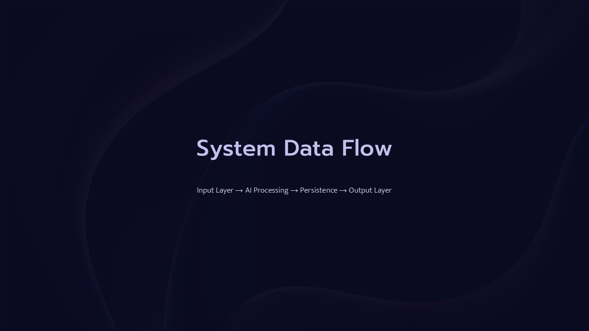

---

### 🎴 Slide 12: IBM Responsible AI & Ethical Framework
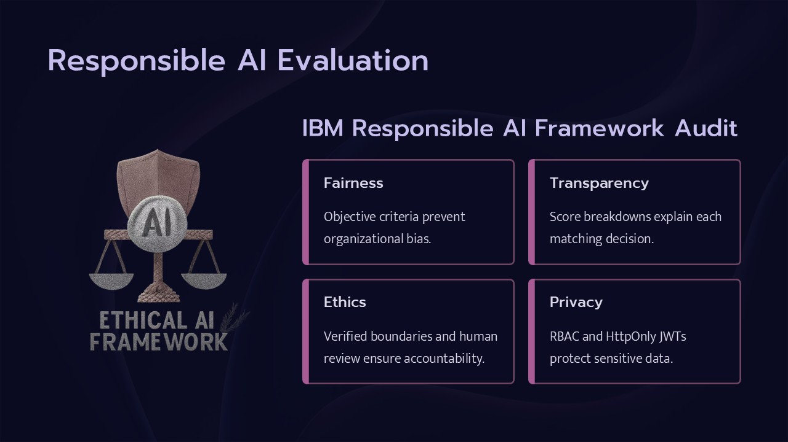

---

### 🎴 Slide 13: Expected Sustainability Impact Metrics
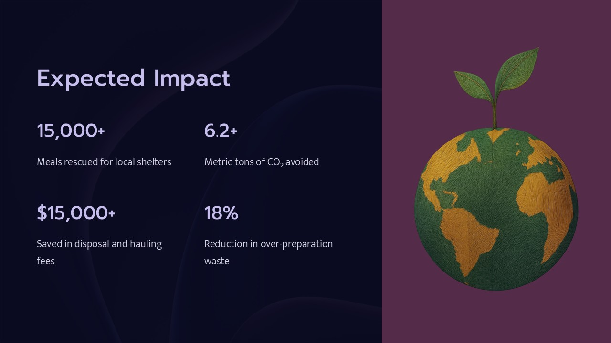

---

### 🎴 Slide 14: Stakeholder Benefits Matrix
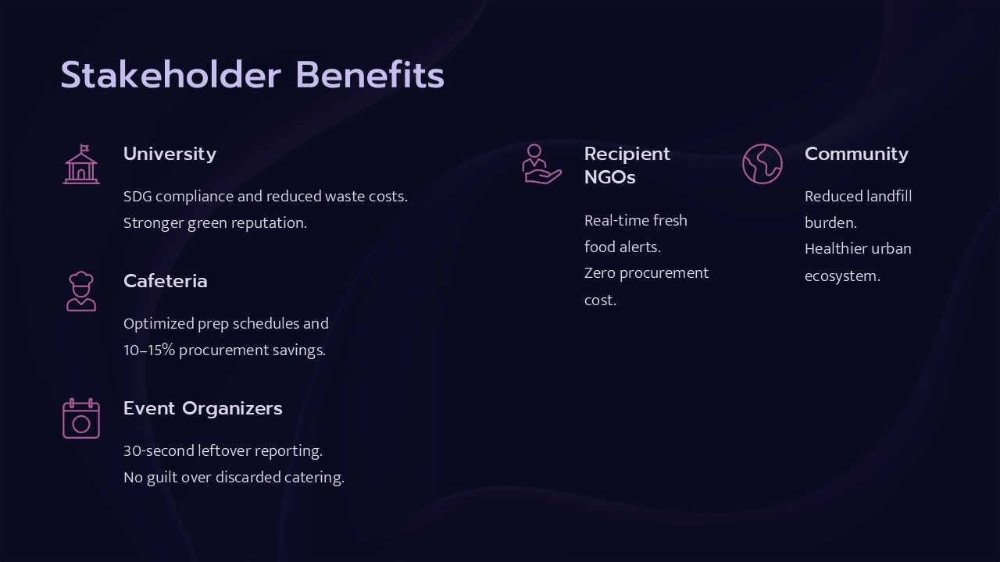

---

### 🎴 Slide 15: Conclusion & Circular Campus Ecosystem
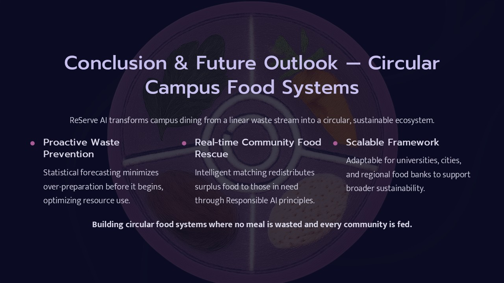

---

### 🎴 Slide 16: Thank You & Contact Information
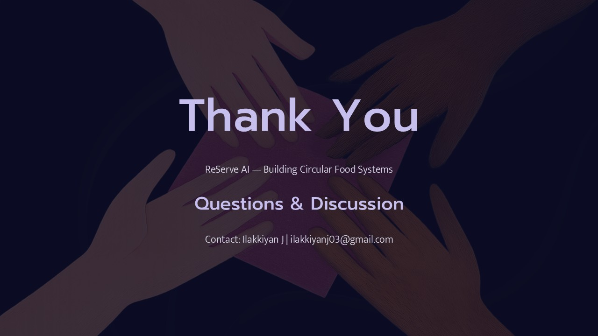

</details>

---

## 📑 1M1B Internship Deliverables

This repository contains complete documentation and deliverables for the **1M1B – IBM SkillsBuild AI + Sustainability Virtual Internship**:

| Deliverable | Description | File Link |
| :--- | :--- | :--- |
| **Deliverable 1** | Project Description, SDG Alignment, Problem Statement & Target Users | [01_project_description.md](file:///d:/Projects/1-active/ReServe%20AI/docs/deliverables/01_project_description.md) |
| **Deliverable 2** | Prototype Architecture, AI Agent Workflows, Prompt & RAG Demos | [02_prototype_and_agent_architecture.md](file:///d:/Projects/1-active/ReServe%20AI/docs/deliverables/02_prototype_and_agent_architecture.md) |
| **Deliverable 3** | Sustainability Impact Statement & Responsible AI Audit | [03_impact_statement_and_responsible_ai.md](file:///d:/Projects/1-active/ReServe%20AI/docs/deliverables/03_impact_statement_and_responsible_ai.md) |
| **Deliverable 4** | Master Presentation Deck (.pptx & Markdown Package) | [04_final_submission_package.md](docs/deliverables/04_final_submission_package.md) & [ReServe-AI-Rescue-More-Waste-Less.pptx](docs/ReServe-AI-Rescue-More-Waste-Less.pptx) |

---

## 🌟 Overview

**ReServe AI** is a full-stack, AI-powered food rescue and sustainability platform designed for university campuses, cafeterias, and institutional dining facilities. It tackles food waste across two complementary operational modes:

1. 🛡️ **PREVENT Mode**: Statistical demand forecasting for cafeteria dining halls to prevent over-preparation waste before food is cooked.
2. 🚚 **RESCUE Mode**: Natural language intake and multi-criteria AI recipient matching to redistribute unavoidable event leftovers to verified local NGOs and shelters.

---

## 👥 Role-Based Access Control (RBAC) & Seed Accounts

ReServe AI supports 4 role-based user personas. You can test any role instantly using the built-in Auth Modal:

| Role | Email | Password | Primary Capabilities |
| :--- | :--- | :--- | :--- |
| **System Administrator** | `admin@campusfoodrescue.ai` | `password123` | Full system overview, recipient verification, impact analytics, notifications |
| **Cafeteria / Mess Manager** | `messmanager@campus.edu` | `password123` | **PREVENT Mode**: Demand forecasting, safety margin prep recommendations, MAE/RMSE evaluation |
| **Campus Event Manager** | `events@studentclub.edu` | `password123` | **RESCUE Mode**: Event registration, manual & natural language text surplus reporting |
| **Recipient Organization** | `contact@carehope.org` | `password123` | **RESCUE Mode**: Reviewing AI match proposals, ACCEPT/REJECT matches, pickup tracking |

---

## 🛠️ Technology Stack

- **Framework**: Next.js 14 (App Router)
- **Language**: TypeScript
- **Styling**: Vanilla CSS + Tailwind CSS (Custom Dark Mode & Glassmorphism Design System)
- **Database**: Neon Postgres (`neondb`) / SQLite (local fallback)
- **ORM**: Prisma ORM
- **Authentication**: Bcryptjs password hashing + JOSE Web Crypto JWT cookies + Next.js Edge Middleware
- **AI Modules**: Decoupled statistical regression, NLP extractor, multi-criteria matching, state machine, and keyword RAG engine

---

## ⚙️ Local Setup & Running Instructions

### 1. Prerequisites
- Node.js v18.x or later
- npm v9.x or later

### 2. Installation
Clone the repository and install dependencies:
```bash
git clone https://github.com/ilakkiyan-j/ReServe-AI.git
cd "ReServe AI"
npm install
```

### 3. Database Sync & Seeding (Neon Postgres)
Initialize database tables and seed demo data:
```bash
npx prisma db push
npm run db:seed
```

### 4. Running the Development Server
Start the local development server:
```bash
npm run dev
```
Open [http://localhost:3000](http://localhost:3000) in your browser.

---

## 📄 License

This project is open-source software licensed under the [MIT License](LICENSE).
Copyright (c) 2026 ReServe AI.
