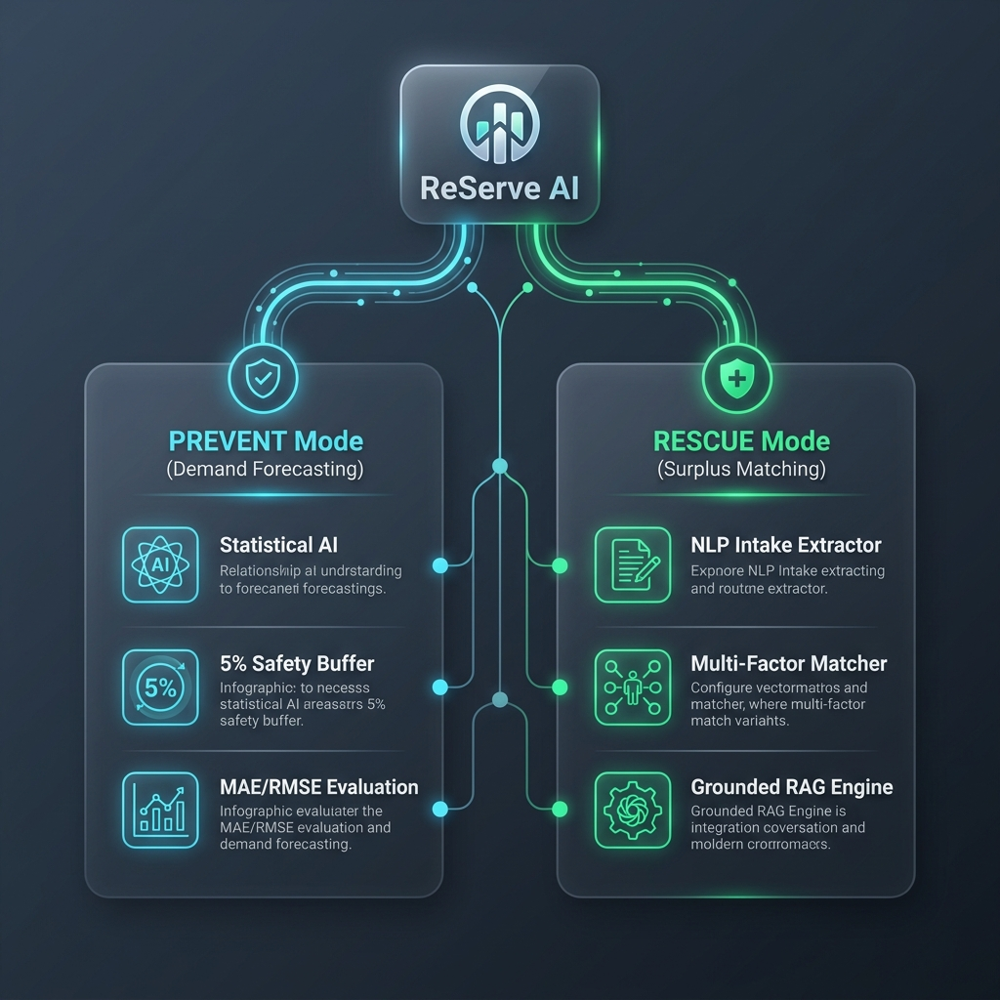

# ReServe AI — Rescue More. Waste Less.

> **Campus Food Surplus Prevention & Intelligent Redistribution Platform**  
> *Developed for the **1M1B – IBM SkillsBuild & AICTE AI for Sustainability Virtual Internship (July–September 2026)**.*  
> *Aligned with United Nations Sustainable Development Goals **SDG 12** (Responsible Consumption & Production), **SDG 2** (Zero Hunger), and **SDG 11** (Sustainable Cities & Communities).*

[](https://re-serve-ai.vercel.app)
[](https://neon.tech)
[](https://nextjs.org)
[](docs/ReServe-AI-Rescue-More-Waste-Less.pptx)
[](LICENSE)

---

## 👨‍🎓 Student & Institutional Information

* **Student Name**: Ilakkiyan J
* **College / Institution Name**: Karpagam College of Engineering
* **Branch / Field of Study**: Computer Science & Design
* **Mentor Name**: Manasa
* **Program**: 1M1B – IBM SkillsBuild AI + Sustainability Virtual Internship
* **Batch**: July – September 2026 Batch

---

## 🚀 Live Demo & Presentation

* **Live Demo URL**: [https://re-serve-ai.vercel.app](https://re-serve-ai.vercel.app)
* **Master Presentation Deck (.pptx)**: [`docs/ReServe-AI-Rescue-More-Waste-Less.pptx`](docs/ReServe-AI-Rescue-More-Waste-Less.pptx) | [Direct Web Download](https://re-serve-ai.vercel.app/ReServe-AI-Rescue-More-Waste-Less.pptx)
* **Cloud Database**: Neon Postgres (`neondb`)
* **GitHub Repository**: [https://github.com/ilakkiyan-j/ReServe-AI.git](https://github.com/ilakkiyan-j/ReServe-AI.git)

---

## 🌟 Problem Statement & UN SDG Alignment

### Problem Statement
University campuses generate significant food waste daily through **over-preparation in cafeterias** and **unavoidable leftovers from campus events**, while nearby shelters and community kitchens experience food shortages.  
> *"How might we use AI to predict cafeteria demand and match surplus event food with verified local rescue organizations so that campus food redistribution becomes sustainable, transparent, and efficient?"*

### Alignment with UN Sustainable Development Goals
* 🎯 **Primary SDG 12: Responsible Consumption & Production** (Target 12.3: Halve global per capita food waste by 2030).
* 🍲 **SDG 2: Zero Hunger** (Target 2.1: Universal access to safe, nutritious food).
* 🏙️ **SDG 11: Sustainable Cities & Communities** (Target 11.6: Reduce municipal waste streams).

---

## 🤖 Core AI Solution & Architecture

ReServe AI operates across two complementary modules:



### 1. 🛡️ PREVENT Mode (Cafeteria Demand Forecasting)
* **Demand Prediction Engine (`demandPredictionAgent.ts`)**: Analyzes meal types, expected student headcount, day of week, and academic calendar status (`REGULAR_CLASS`, `REGULAR_EXAM`, `HOLIDAY`).
* **5% Safety Margin Recommendation**: Recommends preparation quantities with a strict 5% buffer to prevent shortages while minimizing over-cooking.
* **Accuracy Feedback Loop**: Tracks Mean Absolute Error (MAE) and RMSE against actual consumption.

### 2. 🚚 RESCUE Mode (Leftover Redistribution)
* **Natural Language Surplus Intake (`surplusExtractorAgent.ts`)**: Converts unformatted text notices (e.g., *"60 veg meal boxes remaining at Seminar Hall until 8 PM"*) into structured donor listings.
* **Multi-Criteria Recipient Matching (`matchingAgent.ts`)**: Ranks verified recipient NGOs using a 4-factor scoring matrix:
  1. **Capacity Match (30%)**: Matches food quantity to recipient capacity.
  2. **Proximity Score (30%)**: Haversine distance calculation between donor and recipient.
  3. **Deadline Alignment (20%)**: Ensures pickup finishes before food expiration.
  4. **Historical Reliability (20%)**: Factors past completed pickup rates.
* **State Machine Coordination (`coordinationAgent.ts`)**: Manages lifecycle (`ASSIGNED` ➔ `IN_TRANSIT` ➔ `ARRIVED` ➔ `COMPLETED`).
* **Food Safety RAG Assistant (`ragAssistantAgent.ts`)**: Grounded in FDA food handling guidelines (4-hour rule, safe holding temps).

---

## ⚖️ Responsible AI & Sustainability Impact

### Responsible AI Considerations (IBM AI Ethics Framework)
* **Fairness**: Deterministic, unbiased 4-factor scoring matrix for recipient matching.
* **Transparency & Explainability**: 0–100 match score breakdown displayed for every proposal.
* **Human-in-the-Loop**: NLP-extracted listings require manual verification before publishing.
* **Zero Hallucinations**: Only verified NGOs (`verificationStatus === "VERIFIED"`) receive allocations.

### Expected Annual Campus Impact
* 🍲 **15,000+ Nutritious Meals Rescued**
* 🌱 **6.2+ Metric Tons CO₂ Emissions Avoided**
* 💰 **$15,000+ Saved in Waste Disposal Fees**
* 📉 **18% Average Reduction in Cafeteria Over-Preparation**

---

## 👥 Role-Based Access Control (RBAC) & Seed Accounts

ReServe AI supports 4 role-based user personas. You can test any role instantly using the built-in Auth Modal:

| Role | Email | Password | Primary Capabilities |
| :--- | :--- | :--- | :--- |
| **System Administrator** | `admin@campusfoodrescue.ai` | `password123` | Full system overview, recipient verification, impact analytics, notifications |
| **Cafeteria / Mess Manager** | `messmanager@campus.edu` | `password123` | **PREVENT Mode**: Demand forecasting, safety margin prep recommendations, MAE/RMSE evaluation |
| **Campus Event Manager** | `events@studentclub.edu` | `password123` | **RESCUE Mode**: Event registration, manual & natural language text surplus reporting |
| **Recipient Organization** | `contact@carehope.org` | `password123` | **RESCUE Mode**: Reviewing AI match proposals, ACCEPT/REJECT matches, pickup tracking |

---

## 🛠️ Technology Stack

- **Framework**: Next.js 14 (App Router)
- **Language**: TypeScript
- **Styling**: Vanilla CSS + Tailwind CSS (Custom Dark Mode & Glassmorphism Design System)
- **Database**: Neon Postgres (`neondb`) / SQLite (local fallback)
- **ORM**: Prisma ORM
- **Authentication**: Bcryptjs password hashing + JOSE Web Crypto JWT cookies + Next.js Edge Middleware
- **AI Modules**: Decoupled statistical regression, NLP extractor, multi-criteria matching, state machine, and keyword RAG engine

---

## ⚙️ Local Setup & Running Instructions

### 1. Prerequisites
- Node.js v18.x or later
- npm v9.x or later

### 2. Installation
Clone the repository and install dependencies:
```bash
git clone https://github.com/ilakkiyan-j/ReServe-AI.git
cd "ReServe AI"
npm install
```

### 3. Database Sync & Seeding (Neon Postgres)
Initialize database tables and seed demo data:
```bash
npx prisma db push
npm run db:seed
```

### 4. Running the Development Server
Start the local development server:
```bash
npm run dev
```
Open [http://localhost:3000](http://localhost:3000) in your browser.

---

## 📄 License

This project is open-source software licensed under the [MIT License](LICENSE).
Copyright (c) 2026 ReServe AI.
