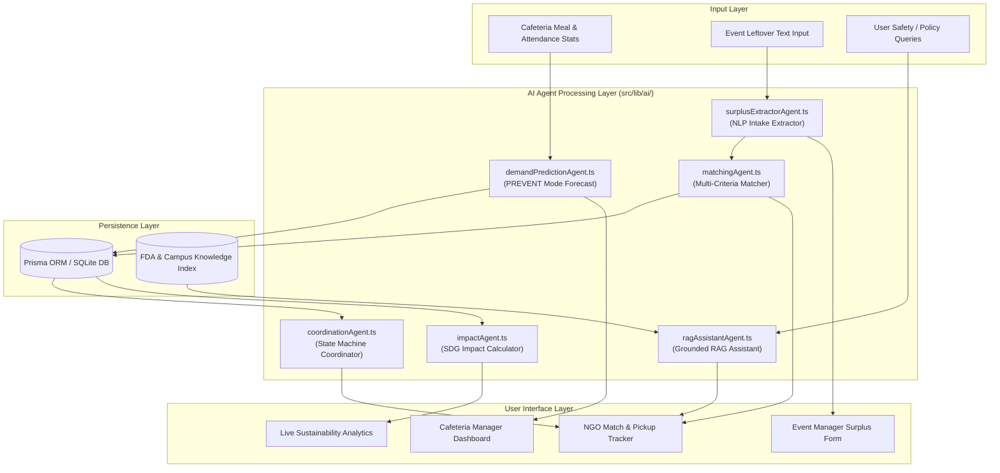
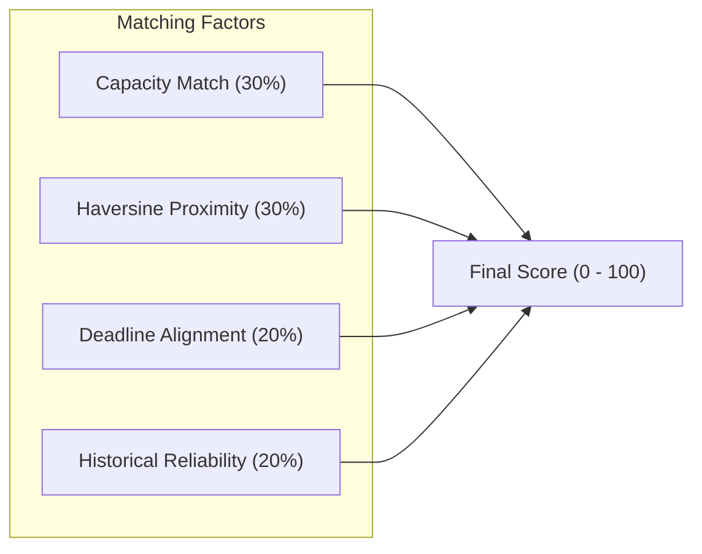
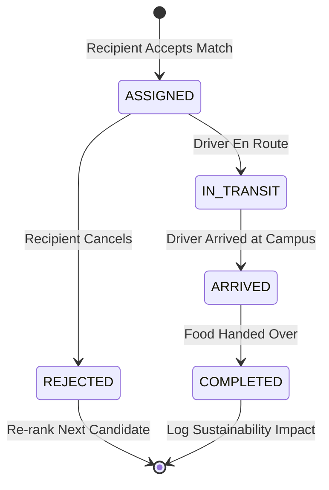

# 1M1B AI for Sustainability Virtual Internship
## Deliverable 2: Prototype & AI Agent Architecture

> **Program**: 1M1B – IBM SkillsBuild AI + Sustainability Virtual Internship  
> **In Collaboration with**: IBM SkillsBuild & AICTE  
> **Project**: ReServe AI — Campus Food Surplus Prevention & Intelligent Redistribution Platform  

---

## 🏗️ 1. Overall System Architecture & AI Pipeline

ReServe AI combines statistical forecasting, natural language processing (NLP), multi-criteria optimization, and Retrieval-Augmented Generation (RAG) into a cohesive architecture.



---

## 🤖 2. Detailed Breakdown of AI Agents

ReServe AI is powered by **6 decoupled AI Agent modules** located in `src/lib/ai/`:

### 2.1 Demand Prediction Agent (`demandPredictionAgent.ts`)
* **Purpose**: Prevents over-cooking in campus dining halls before food is prepared.
* **Logic**: Calculates baseline meal consumption using historical meal ratios (Breakfast: 0.85, Lunch: 1.10, Dinner: 0.95, Snacks: 0.50), modified by day-of-week factors and academic calendar status (`REGULAR_CLASS`: 1.0, `REGULAR_EXAM`: 1.15, `HOLIDAY`: 0.35).
* **5% Safety Buffer Algorithm**:
  $$\text{Recommended Prep} = \lceil \text{Predicted Consumption} \times 1.05 \rceil$$
* **Evaluation Engine**: Computes Mean Absolute Error (MAE) and Root Mean Squared Error (RMSE) when actual dining counts are submitted.

### 2.2 Natural Language Intake Extractor (`surplusExtractorAgent.ts`)
* **Purpose**: Parses freeform text descriptions of leftover food into structured database records.
* **Input Example**:
  > *"We have about 45 boxed vegetarian lunches left over from the AI Symposium at Student Center Hall B until 7:30 PM."*
* **Extracted Schema**:
  ```json
  {
    "quantitySpoken": "45 boxed vegetarian lunches",
    "estimatedServings": 45,
    "foodCategory": "VEGETARIAN",
    "location": "Student Center Hall B",
    "availableUntil": "19:30",
    "confidenceScore": 92,
    "warnings": []
  }
  ```
* **No-Hallucination Safeguard**: Unmentioned details default to `"unknown"` with explicit warnings returned to the user interface.

### 2.3 Verified Recipient Matching Agent (`matchingAgent.ts`)
* **Purpose**: Finds the optimal verified NGO or shelter to receive surplus food.
* **Scoring Formula**:
  $$\text{Match Score} = (0.30 \times \text{Capacity}) + (0.30 \times \text{Proximity}) + (0.20 \times \text{Deadline}) + (0.20 \times \text{Reliability})$$



* **Proximity Calculation**: Computes exact Haversine distance ($d$) between surplus location and recipient coordinates:
  $$d = 2r \arcsin \left( \sqrt{\sin^2\left(\frac{\Delta \phi}{2}\right) + \cos(\phi_1)\cos(\phi_2)\sin^2\left(\frac{\Delta \lambda}{2}\right)} \right)$$
  - Distance $< 2\text{ km} \rightarrow \text{Score } 98$
  - Distance $2 - 5\text{ km} \rightarrow \text{Score } 88$
  - Distance $5 - 10\text{ km} \rightarrow \text{Score } 75$
  - Distance $> 10\text{ km} \rightarrow \text{Score } 55$

### 2.4 Coordination State Machine Agent (`coordinationAgent.ts`)
* **Purpose**: Coordinates the physical pickup workflow and logs real-time updates.
* **State Machine**:



### 2.5 Sustainability Impact Agent (`impactAgent.ts`)
* **Purpose**: Aggregates real-time database metric conversions for SDG 12 reporting.
* **Conversion Constants**:
  - Meals Rescued = Direct count from completed surplus requests
  - Food Saved (kg) = $\text{Meals} \times 0.42\text{ kg/meal}$
  - Disposal Cost Saved ($) = $\text{Food Saved (kg)} \times \$2.50/\text{kg}$
  - CO2 Avoided (kg) = $\text{Food Saved (kg)} \times 2.50\text{ kg-CO2/kg}$

### 2.6 Grounded RAG Knowledge Assistant (`ragAssistantAgent.ts`)
* **Purpose**: Answers user questions about food safety guidelines, the 4-Hour Rule, and campus food rescue rules.
* **Workflow**:
  1. Searches indexed knowledge base (`FDA Food Code 2023`, `Campus Food Safety Manual`).
  2. Extracts top matching text paragraphs using TF-IDF token scoring.
  3. Synthesizes answers strictly bounded by retrieved passage text.
  4. Out-of-domain queries (e.g., general trivia) are rejected with a safety message.

---

## 🧪 3. Prototype Demonstration Workflows

### Demo Scenario A: Natural Language Surplus Intake
1. **User Action**: Event Manager types: *"Leftover 50 chicken sandwiches from Dean's Meeting at Administrative Building Floor 3 available for the next 2 hours."*
2. **AI Action**: `surplusExtractorAgent` processes text, returning 50 estimated servings, non-vegetarian category, location "Administrative Building Floor 3", and deadline timestamp.
3. **Verification**: Editable preview renders on screen allowing 1-click confirmation.

### Demo Scenario B: Multi-Criteria Recipient Matching
1. **Trigger**: Surplus request created for 50 servings.
2. **AI Action**: `matchingAgent` queries all `VERIFIED` recipient organizations, calculates Haversine distance, checks current capacity, evaluates deadline, and ranks candidates.
3. **Output**: Top candidate `Care & Hope Shelter` displayed with 94/100 score and explicit score breakdown.

---

*Submitted as part of the 1M1B – IBM SkillsBuild AI + Sustainability Virtual Internship July-Sep 2026.*
