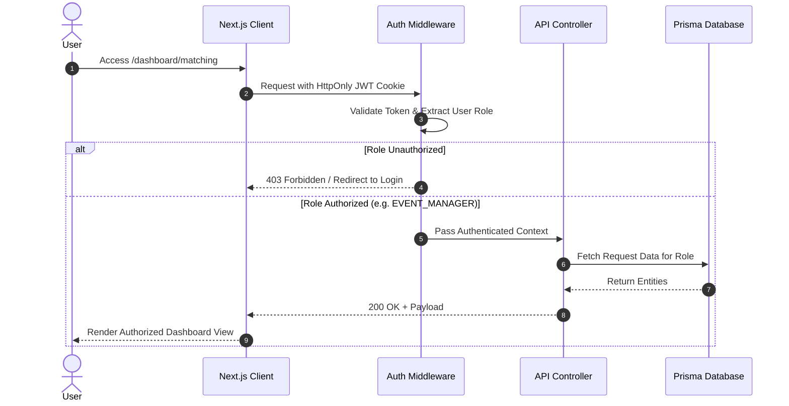

# System Architecture & Component Interaction Diagrams — Campus Food Rescue AI

## 1. High-Level System Architecture Diagram

```mermaid
graph TD
    subgraph Client Layer (Next.js React Frontend)
        UI_AUTH[Auth & RBAC Module]
        UI_EVENT[Event & Surplus Manager]
        UI_PREVENT[Cafeteria Demand Forecast]
        UI_MATCH[Matching & Pickup Portal]
        UI_IMPACT[Impact Analytics Dashboard]
        UI_RAG[Sustainability RAG Assistant]
        UI_NOTIFY[Notification Bell]
    end

    subgraph API Layer (Next.js Server Actions & API Routes)
        API_AUTH[Auth API / JWT Handler]
        API_SURPLUS[Surplus API]
        API_PREDICT[Prediction Engine API]
        API_MATCH[Matching Agent API]
        API_PICKUP[Pickup Coordination API]
        API_NOTIFY[Notifications API]
        API_RAG[RAG QA API]
    end

    subgraph AI Processing Layer (lib/ai/)
        AI_EXTRACT[Surplus Intake Extractor]
        AI_PREDICT[Demand Forecasting Agent]
        AI_MATCH[Recipient Matching Agent - Haversine + Real Reliability]
        AI_COORDINATE[Coordination & Status Agent - DB Notifications]
        AI_IMPACT[Sustainability Impact Agent - Real DB Metrics]
        AI_RAG[RAG Assistant - Document Content Retrieval]
    end

    subgraph Data & Storage Layer
        PRISMA[Prisma ORM Client]
        DB[(SQLite / PostgreSQL DB\nUsers · Orgs · Events · Surplus\nPickups · ImpactLogs · Notifications\nKnowledgeDocs · CafeteriaDemandLogs)]
    end

    UI_AUTH --> API_AUTH
    UI_EVENT --> API_SURPLUS
    UI_PREVENT --> API_PREDICT
    UI_MATCH --> API_MATCH
    UI_MATCH --> API_PICKUP
    UI_IMPACT --> API_MATCH
    UI_NOTIFY --> API_NOTIFY
    UI_RAG --> API_RAG

    API_AUTH --> PRISMA
    API_SURPLUS --> AI_EXTRACT
    API_SURPLUS --> PRISMA
    API_PREDICT --> AI_PREDICT
    API_PREDICT --> PRISMA
    API_MATCH --> AI_MATCH
    API_MATCH --> PRISMA
    API_PICKUP --> AI_COORDINATE
    API_PICKUP --> PRISMA
    API_NOTIFY --> AI_COORDINATE
    API_NOTIFY --> PRISMA
    API_RAG --> AI_RAG
    AI_RAG --> PRISMA

    PRISMA --> DB
```

---

## 2. Security Boundaries & Authorization Flow


