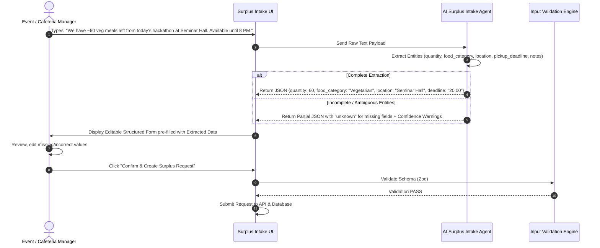

# AI Natural Language Surplus Intake Workflow — Campus Food Rescue AI

## 1. Natural Language Extraction Workflow



---

## 2. Extraction Schema & Strict Safeguards

```json
{
  "quantityPortions": 60,
  "foodCategory": "VEGETARIAN",
  "location": "Seminar Hall, Ground Floor",
  "pickupDeadline": "2026-08-20T20:00:00Z",
  "notes": "Leftover from afternoon hackathon session",
  "confidenceScore": 0.92
}
```

### Strict Safeguards
1. **Never Invent Data**: If the user omits location or deadline, the agent outputs `unknown` and highlights the field in red on the preview form for mandatory user input.
2. **Never Auto-Submit**: Extracted data must ALWAYS be presented to a human user for verification before persistent storage.
