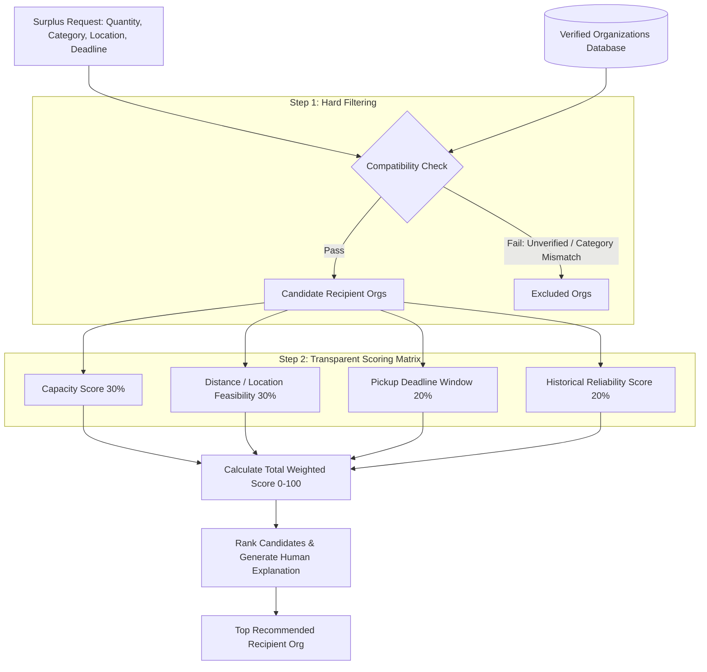

# AI Recipient Matching Agent Specification — Campus Food Rescue AI

## 1. Multi-Criteria Matching Algorithm

The **AI Matching Agent** (`lib/ai/matchingAgent.ts`) ranks verified recipient organizations based on transparent score calculations.



---

## 2. Scoring Formula Breakdown

```
Total Score = (S_capacity × 0.30) + (S_distance × 0.30) + (S_deadline × 0.20) + (S_reliability × 0.20)
```

Where:
- **S_capacity** (30%): Ratio of requested portions to organization's available capacity. Score ≥ 95 when org capacity ≥ portions; decreases proportionally if over-capacity.
- **S_distance** (30%): Computed via **Haversine great-circle distance** between surplus pickup coordinates and org coordinates. Mapped to score: ≤2 km → 98, ≤5 km → 88, ≤10 km → 75, >10 km → 55. Falls back to service-area text heuristic (with `potentialIssues` warning) when lat/lon is unavailable.
- **S_deadline** (20%): Time buffer evaluation — hours until pickup deadline mapped to score: >2 h → 95, ≤2 h → 80, ≤1 h → 65.
- **S_reliability** (20%): **Computed from real `PickupTask` history** — `COMPLETED / (COMPLETED + FAILED) × 100` per organization. Organizations with no resolved history default to 70 (neutral). Passed into the agent as `reliabilityMap: Record<orgId, number>` by the matching API route.

---

## 3. Explainable Match Output Payload Example

```json
{
  "surplusRequestId": "req-8812",
  "recommendedOrganization": {
    "id": "org-401",
    "name": "Community Care Hope Shelter",
    "verificationStatus": "VERIFIED"
  },
  "totalMatchScore": 91.5,
  "scoreBreakdown": {
    "capacityScore": 95.0,
    "distanceScore": 90.0,
    "deadlineScore": 90.0,
    "reliabilityScore": 90.0
  },
  "explanation": "Organization 'Community Care Hope Shelter' has 100 portion capacity (requires 60), accepts Vegetarian meals, is located 2.1km away, and operates until 21:00 (pickup deadline is 20:00).",
  "alternativeCandidates": [
    {
      "orgName": "City Youth Harvest",
      "totalMatchScore": 78.0,
      "reason": "Lower available capacity (40 portions vs 60 needed)."
    }
  ]
}
```
