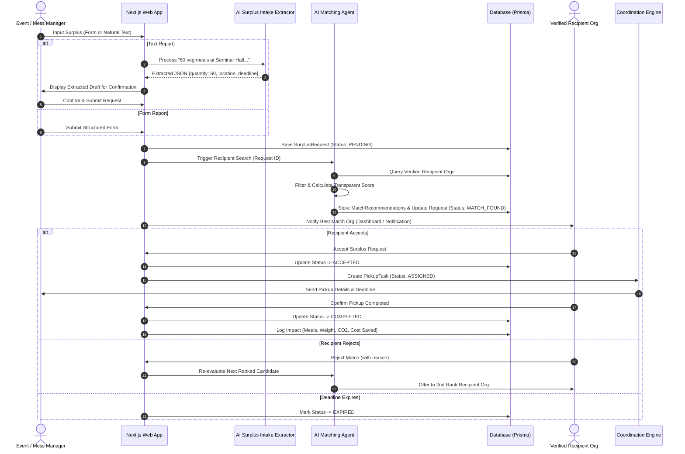
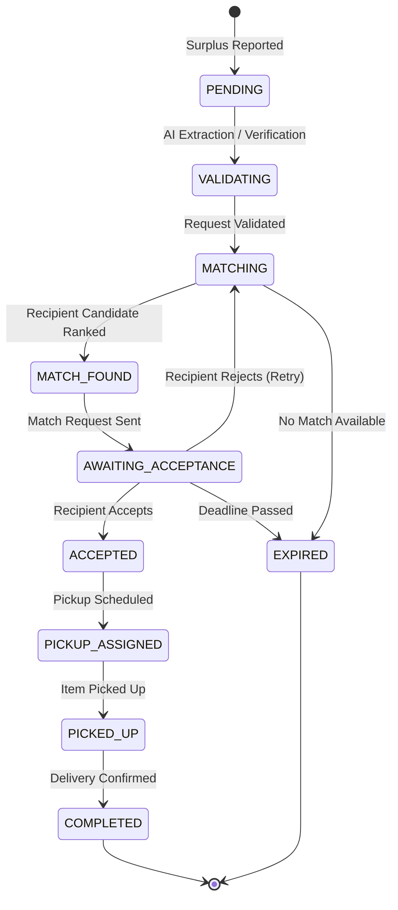

# Surplus Food Rescue Workflow Specification — Campus Food Rescue AI

## 1. End-to-End Lifecycle Sequence Diagram

```mermaid
sequenceDiagram
    autonumber
    actor Organizer as Event / Mess Manager
    participant App as Next.js Web App
    participant Extractor as AI Surplus Intake Extractor
    participant Matcher as AI Matching Agent
    participant DB as Database (Prisma)
    actor Recipient as Verified Recipient Org
    participant Pickup as Coordination Engine

    Organizer->>App: Input Surplus (Form or Natural Text)
    alt Text Report
        App->>Extractor: Process "60 veg meals at Seminar Hall..."
        Extractor-->>App: Extracted JSON {quantity: 60, location, deadline}
        App->>Organizer: Display Extracted Draft for Confirmation
        Organizer->>App: Confirm & Submit Request
    else Form Report
        Organizer->>App: Submit Structured Form
    end

    App->>DB: Save SurplusRequest (Status: PENDING)
    App->>Matcher: Trigger Recipient Search (Request ID)
    Matcher->>DB: Query Verified Recipient Orgs
    Matcher->>Matcher: Filter & Calculate Transparent Score
    Matcher->>DB: Store MatchRecommendations & Update Request (Status: MATCH_FOUND)

    App->>Recipient: Notify Best Match Org (Dashboard / Notification)
    alt Recipient Accepts
        Recipient->>App: Accept Surplus Request
        App->>DB: Update Status -> ACCEPTED
        App->>Pickup: Create PickupTask (Status: ASSIGNED)
        Pickup->>Organizer: Send Pickup Details & Deadline
        Recipient->>App: Confirm Pickup Completed
        App->>DB: Update Status -> COMPLETED
        App->>DB: Log Impact (Meals, Weight, CO2, Cost Saved)
    else Recipient Rejects
        Recipient->>App: Reject Match (with reason)
        App->>Matcher: Re-evaluate Next Ranked Candidate
        Matcher->>Recipient: Offer to 2nd Rank Recipient Org
    else Deadline Expires
        App->>DB: Mark Status -> EXPIRED
    end
```

---

## 2. Surplus Request State Machine

```mermaid
stateDiagram-v2
    [*] --> PENDING: Surplus Reported
    PENDING --> VALIDATING: AI Extraction / Verification
    VALIDATING --> MATCHING: Request Validated
    MATCHING --> MATCH_FOUND: Recipient Candidate Ranked
    MATCH_FOUND --> AWAITING_ACCEPTANCE: Match Request Sent
    AWAITING_ACCEPTANCE --> ACCEPTED: Recipient Accepts
    AWAITING_ACCEPTANCE --> MATCHING: Recipient Rejects (Retry)
    ACCEPTED --> PICKUP_ASSIGNED: Pickup Scheduled
    PICKUP_ASSIGNED --> PICKED_UP: Item Picked Up
    PICKED_UP --> COMPLETED: Delivery Confirmed
    AWAITING_ACCEPTANCE --> EXPIRED: Deadline Passed
    MATCHING --> EXPIRED: No Match Available
    COMPLETED --> [*]
    EXPIRED --> [*]
```
